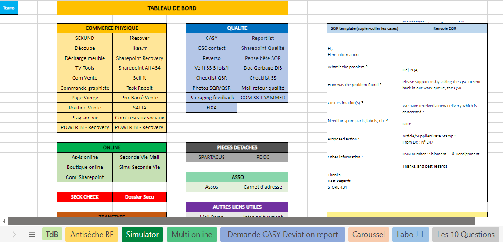
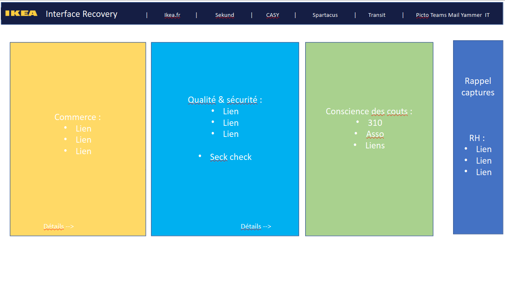
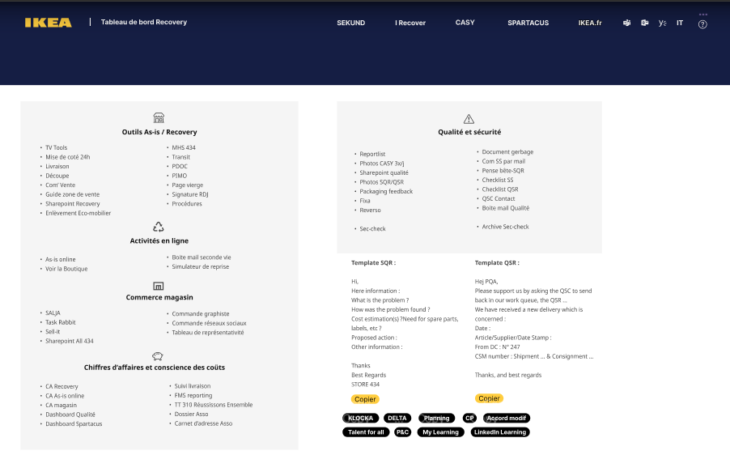
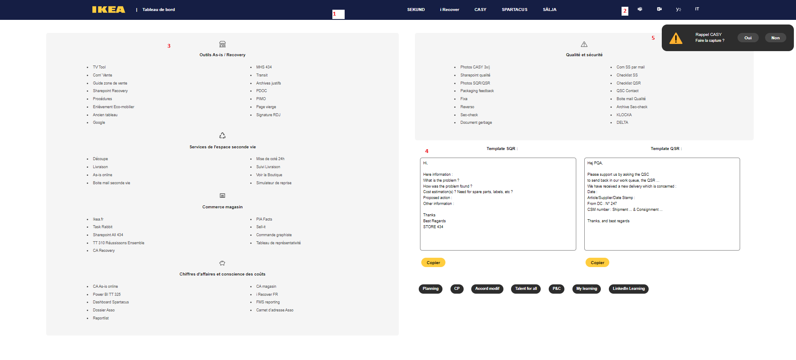

This README file was generated on 2024-02-24 by Tiffanie Quilbeud.
Last updated: 2024-02-24.
 
# Title: IKEA Dashboard
 Contact email : tiffaniequilbeuf2@gmail.com
 
## Context 

I've created this project when I worked at Ikea Tours. 
The company deceide to change their organization and put all our document on Sharepoint. We had less access and a lot of web app and sharepoints links to follow. 
I've created this dashboard to centralized all usual links and thought about some other helpers.  

Before Cefim I add all our links on Excel document + helpers : 

When I learned by myself HTML + CSS, I proposed to my team to organised it on a training projet. I use charter Ikea (police, colors) 

I did a first wireframe :

and they let me white card. You can see more on [this Powerpoint](./_about-this-project/Idee-interface-recov.pptx). I've been thinking how order of links because there was to much categories, it began to become less clear.

I created after a model on [Maquette Figma](https://www.figma.com/file/2lsOPfLC8PAy5mBreBDRbE/test-ikea?type=design&node-id=0-1&mode=design). 

 
## How does it work ?

This dashboard exist only on local. 

 Co-workers download the project located on sharepoint to their local OneDrive. They add a shortcut on their desk. To maintain code, they delete [linkers](./linkers.js) when they change a link and download the new to replace. I wrote theim process in an email in plus of [tutos](./tutos). 

## Description of dashboard :
 
 
 At the end, the dashboard looks like the photo. There is :
  1. Navigation bar in 2 part : at first main app/tools in this Team
  2. second, all apps to communicate like email, teams ...
  3. Linkers ordered in different categories
  4. Templates for quality rapports
  5. Alert quality

## Description of sources :

There is :
 - [index.html](./index.html) to read the project and see structure
 - [style sheet](./style.css) with pre-processor of Eric Meyer, after my code
 - [JavaScript List](./linkers.js) contain all usual links. There are add in DOM by a forEach. 
 - [dynamics](./dynamics.js) who contain others functions witch are copy a resume of a quality report and create an alert for quality at 10, 13, and 18 hours. 
 - [img](./img) for all images in this project (svg, ico, png).
 - [tutos](./tutos) for all tutorial I created. It help to install dashbord and maintain code by coworkers. It's only on Powerpoint
 - Folder [about-this-project](./_about-this-project) and [README](./README.md) are last add (on 2024 to explain project). 
 
## More informations : 

If I have to change something today, I want people don't open code. I test some thingks to record and URL without going inside code but find another solutions because I rest on local storage. 
You can see it on this [codepen.io](https://codepen.io/tquilb29/pen/GRzJrWe). 
It change URL + name but I didn't have backup after. 

Contact me and I can explain this project.
_Tutos are not yet available because of sensible links. I send it later._ 